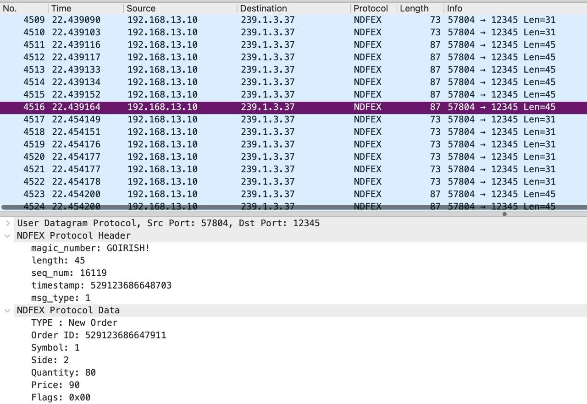

# NDFEX Wireshark Dissector

Wireshark dissectors can be made to analyze protocols not natively supported by Wireshark.

NDFEX-Dissector is a dissector made by Jachob Dolak for the NDFEX protocol for Notre Dames's High Frequency Trading Techonologies class.
  
  


## Installation

To install, copy this file to your Wireshark plugins direcroty.  
  
This can be done with the following command on MacOS:  
```sh
cp ./wireshark_dissector.lua /Applications/Wireshark.app/Contents/PlugIns/wireshark/wireshark_dissector.lua`
```
After, reload Wireshark's plugins.

## Contributing

This was done very quick and dirty so please make an issue or PR if something can be improved.

More on wireshark dissectors can be found here:
- [https://wiki.wireshark.org/lua/dissectors](https://wiki.wireshark.org/lua/dissectors)


